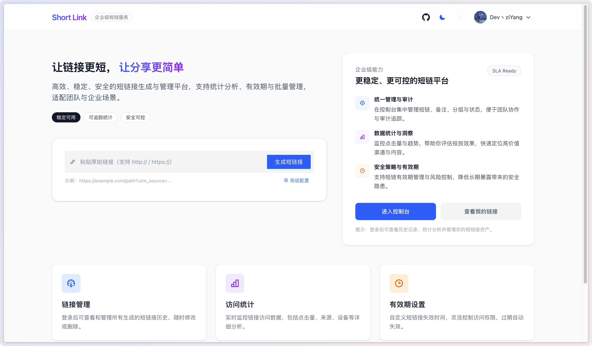
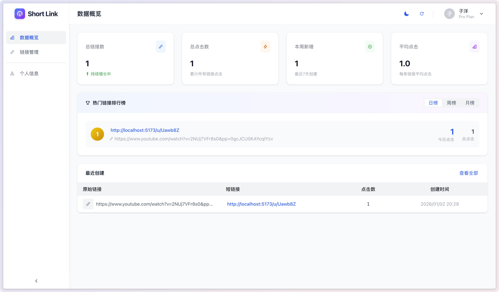
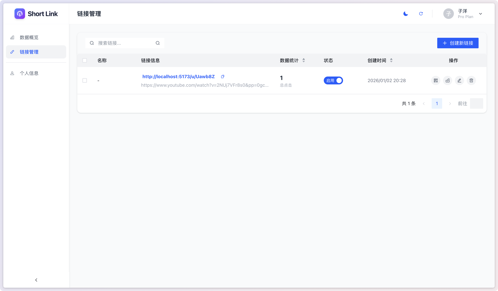
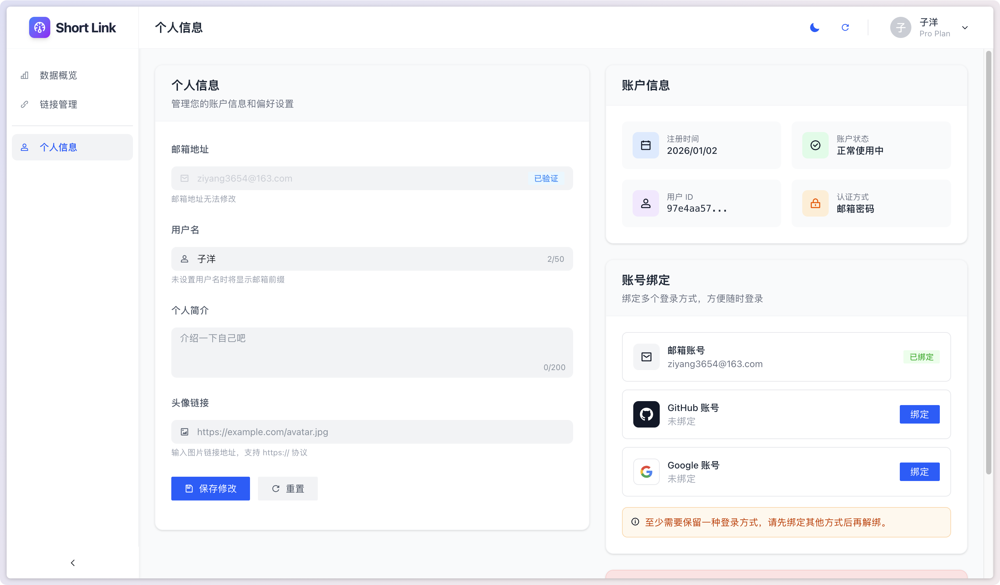
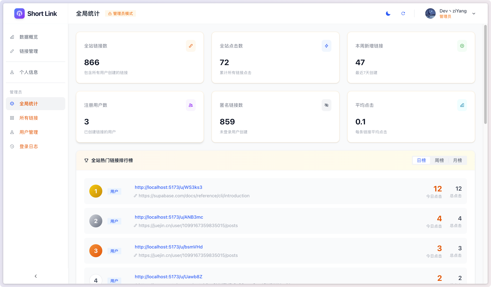
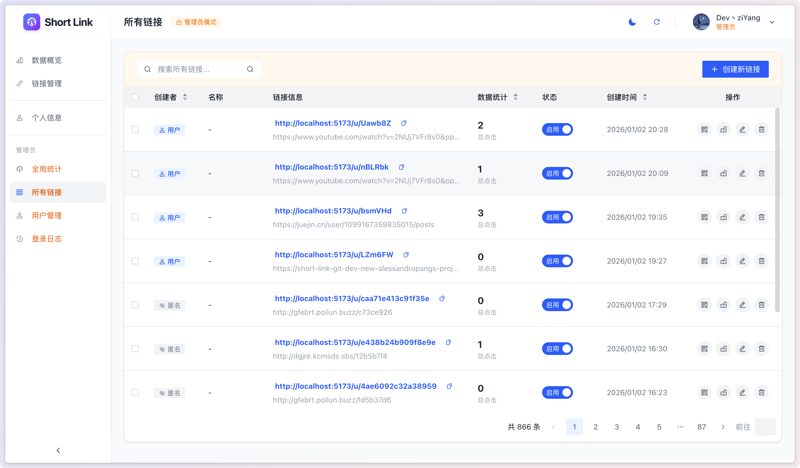
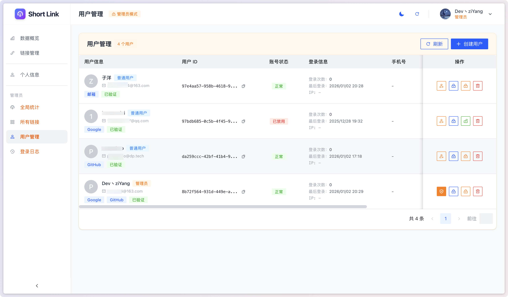
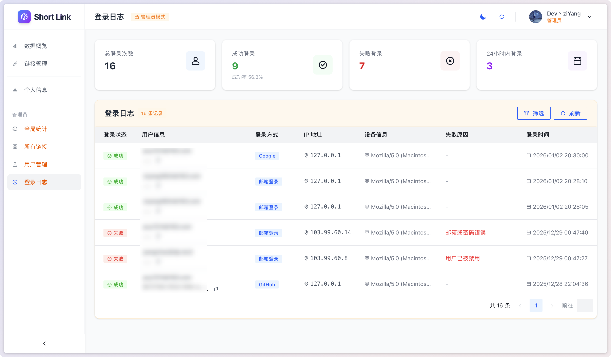

# Short Link Service (Short Link V2.0)

[简体中文](./README.md) | [English](./README.en-US.md)

A fully-featured URL shortening service built with Vue 3, Fastify, Vercel, and Supabase.

> Note:
>
> The current V2.0 version has extensive updates, resulting in incomplete test coverage and some features not being fully implemented.

## 📖 Overview

The short link service allows users to quickly shorten URLs for easy sharing and management. It supports anonymous link creation and link management after user login, providing rich link configuration options and detailed access statistics.

> Note:
>
> The current V2.0 version has significant updates compared to V1.0. The tutorial below currently cannot fully cover the deployment process. The V2.0 deployment tutorial is being prepared, so please be patient.

### V1.0 Deployment Tutorial

- 📝 Implementation Principle: [In Half an Hour, I Built a Short Link Service](https://juejin.cn/post/7511983823259189287)
- 🚀 Deployment Tutorial: [Build a Free and Stable Private Short Link Service from Scratch](https://juejin.cn/post/7511671401683992587)

## 🌐 Live Demo

Visit [https://short.pangcy.cn](https://short.pangcy.cn) to experience the full features.

## ✨ Features

### Core Features
- **Short Link Generation**: Quickly convert long URLs to short links
- **QR Code Generation**: Automatically generate QR codes for short links
- **Link Expiration**: Set expiration time for links
- **Visit Limit**: Set maximum number of visits
- **Password Protection**: Set an access password for links

### Advanced Features
- **Access Statistics**: Detailed analytics on clicks, sources, devices, etc.
- **Access Restrictions**:
  - IP Whitelist/Blacklist
  - Device Type Restrictions (Mobile/Tablet/Desktop)
  - Referrer Domain Restrictions
  - Country/Region Restrictions
- **Redirect Configuration**: Supports multiple redirect types (301/302/307/308)
- **Query Parameter Pass-through**: Option to pass original URL parameters to the target URL
- **Request Header Forwarding**: Supports custom forwarding of request headers

### User Features
- **User Authentication**: Supports email registration/login and third-party OAuth login
- **Link Management**: View, edit, and delete personally created links
- **Batch Operations**: Batch enable/disable and delete links
- **Dashboard**: Overview of personal link statistics
- **Top Charts**: View the most clicked links

### Admin Features
- **Global Statistics**: Stats on total links, clicks, users, etc.
- **User Management**: View user list, disable/enable users, reset passwords
- **Link Moderation**: Manage links created by all users (including anonymous users)
- **Login Logs**: View user login records and anomaly detection
- **Access Logs**: View detailed access records for all links

## 🛠 Tech Stack

### Frontend
- **Vue 3** - Progressive JavaScript Framework
- **Pinia** - Vue State Management
- **Vue Router** - Routing Management
- **Arco Design Vue** - UI Component Library
- **TailwindCSS 4** - Utility-First CSS Framework
- **Vite 7** - Next-Gen Frontend Build Tool

### Backend
- **Fastify 5** - High-Performance Node.js Web Framework
- **Supabase** - Open-Source Firebase Alternative (PostgreSQL Database + Auth)
- **nanoid** - Short Link ID Generation

### Deployment
- **Vercel** - Edge Deployment Platform (Serverless Functions)

## 📁 Project Structure

```
short-link/
├── api/                    # Vercel Serverless Entry
│   └── index.ts
├── server/                 # Backend Service
│   ├── config/             # Configuration Management
│   ├── controllers/        # Controller Layer
│   ├── database/           # Database Client
│   ├── middlewares/        # Middleware (Authentication, Error Handling, etc.)
│   ├── routes/             # Route Definitions
│   ├── services/           # Business Logic Layer
│   ├── templates/          # Template Files
│   ├── types/              # Type Definitions
│   └── utils/              # Utility Functions
├── src/                    # Frontend Source Code
│   ├── assets/             # Static Assets
│   ├── components/         # Common Components
│   ├── composables/        # Composables
│   ├── router/             # Router Configuration
│   ├── services/           # API Services
│   ├── stores/             # Pinia State Management
│   ├── types/              # Type Definitions
│   ├── utils/              # Utility Functions
│   └── views/              # Page Components
│       ├── account/        # Account Related
│       ├── dashboard/      # Dashboard
│       │   ├── admin/      # Admin Pages
│       │   ├── links/      # Link Management
│       │   ├── profile/    # Profile Information
│       │   └── stats/      # Data Statistics
│       ├── error/          # Error Pages
│       ├── home/           # Home Page
│       ├── login/          # Login
│       ├── password/       # Password Verification
│       └── register/       # Registration
├── config/                 # Project Configuration
├── types/                  # Global Type Definitions
├── supabase/               # Supabase Configuration
└── public/                 # Public Static Assets
```

## 🚀 Quick Start

### Prerequisites

- Node.js 18+
- pnpm
- Vercel CLI
- Supabase Project

### Installation

```bash
# Clone the repository
git clone https://github.com/Alessandro-Pang/short-link.git

# Navigate to the project directory
cd short-link

# Install dependencies
pnpm install
```

### Configure Environment Variables

1. Install Vercel CLI globally:

   ```bash
   npm install -g vercel@latest
   ```

2. Link Vercel project:

   ```bash
   vercel link
   ```

3. Pull environment variables:

   ```bash
   vercel env pull .env.development.local
   ```

### Local Development

```bash
# Start both frontend and backend dev servers
pnpm dev

# Start frontend only
pnpm dev:web

# Start backend only
pnpm dev:api
```

After the development server starts:
- Frontend: http://localhost:5173
- Backend API: http://localhost:3000
- API Documentation: http://localhost:3000/api/docs (Development Only)

### Build & Deploy

```bash
# Build frontend
pnpm build

# Type check
pnpm type-check
```

## ⚙️ Environment Variables

| Variable | Description | Required |
|----------|-------------|----------|
| `SUPABASE_URL` | Supabase Project URL | ✅ |
| `SUPABASE_ANON_KEY` | Supabase Anonymous Key | ✅ |
| `SUPABASE_SERVICE_ROLE_KEY` | Supabase Service Role Key | ✅ |
| `VITE_SUPABASE_URL` | Frontend Supabase URL | ✅ |
| `VITE_SUPABASE_ANON_KEY` | Frontend Supabase Key | ✅ |
| `ALLOWED_ORIGINS` | Allowed CORS Origins (comma-separated) | ❌ |
| `DEV_SERVER_PORT` | Development Server Port (default 3000) | ❌ |
| `URL_SAFETY_ENABLED` | URL Safety Check Toggle, set to `false` to disable (enabled by default) | ❌ |
| `GOOGLE_SAFE_BROWSING_KEY` | Google Safe Browsing API Key, enables Google Safe Browsing detection when configured | ❌ |

### URL Safety Check Configuration

When creating a short link, the server performs a safety check on the target URL. The current check pipeline includes domain allow/deny lists, suspicious content scraping and keyword detection, and optional Google Safe Browsing detection.

By default, URL safety checking is enabled:

```env
URL_SAFETY_ENABLED=true
```

To disable safety checking, set the following in your server environment variables:

```env
URL_SAFETY_ENABLED=false
```

Google Safe Browsing detection is not enabled by default. After obtaining a Google Safe Browsing API Key, configure the following environment variable to enable it:

```env
GOOGLE_SAFE_BROWSING_KEY=your_google_safe_browsing_api_key
```

> Note: `GOOGLE_SAFE_BROWSING_KEY` only takes effect when `URL_SAFETY_ENABLED` is not disabled. If the safety check encounters an exception, short link creation requests will be rejected to prevent high-risk links from being allowed when detection is unavailable.

## 👑 Admin Setup

Admin accounts need to be manually set in the Supabase database.

**Method 1: Via Table Editor (Recommended)**

1. Log in to the [Supabase Dashboard](https://supabase.com/dashboard)
2. Go to your project
3. Click **Table Editor** in the left menu
4. Select the `user_profiles` table
5. Find the user to set as admin
6. Check the `is_admin` field (set to `true`)

**Method 2: Via SQL Editor**

```sql
-- Set admin (replace UUID with actual user ID)
UPDATE user_profiles SET is_admin = true WHERE id = 'xxxxxxxx-xxxx-xxxx-xxxx-xxxxxxxxxxxx';

-- Remove admin
UPDATE user_profiles SET is_admin = false WHERE id = 'xxxxxxxx-xxxx-xxxx-xxxx-xxxxxxxxxxxx';

-- View all admins
SELECT * FROM user_profiles WHERE is_admin = true;
```

## 🔒 Security Features

### Rate Limiting

| Endpoint Type | Limit |
|----------|------|
| Global | 100 requests/min |
| Create Short Link | 10 requests/min |
| Login Related | 5 requests/min |
| Admin Endpoints | 50 requests/min |
| Batch Operations | 20 requests/min |
| Short Link Redirects | 200 requests/min |

### SSRF Protection

- Blocks internal addresses and private IPs
- Blocks dangerous ports (22, 3306, 5432, 6379, etc.)
- Blocks cloud service metadata endpoints
- Blocks dangerous protocols (javascript, data, file, etc.)

### URL Safety Check

- Enabled by default, can be disabled via `URL_SAFETY_ENABLED=false`
- Supports domain allow/deny lists and high-risk TLD detection
- Supports page title, description, and body keyword detection
- Enables Google Safe Browsing detection after configuring `GOOGLE_SAFE_BROWSING_KEY`
- Rejects short link creation if checks fail, and displays risk warnings and an appeal entry on the frontend

## 📸 Interface Preview

### User Side

| | |
|:---:|:---:|
|  |  |
|  |  |

### Admin Side

| | |
|:---:|:---:|
|  |  |
|  |  |


## 🤝 Contributing

Contributions are welcome! Please fork the repository and submit a Pull Request.

1. Fork this repository
2. Create a feature branch (`git checkout -b feature/AmazingFeature`)
3. Commit changes (`git commit -m 'Add some AmazingFeature'`)
4. Push to the branch (`git push origin feature/AmazingFeature`)
5. Open a Pull Request

## 📄 License

This project is licensed under the MIT License - see the [LICENSE](./LICENSE) file for details.

## 📧 Contact

- GitHub: [@Alessandro-Pang](https://github.com/Alessandro-Pang)
- Project Homepage: [https://github.com/Alessandro-Pang/short-link](https://github.com/Alessandro-Pang/short-link)
- Issue Tracking: [https://github.com/Alessandro-Pang/short-link/issues](https://github.com/Alessandro-Pang/short-link/issues)
