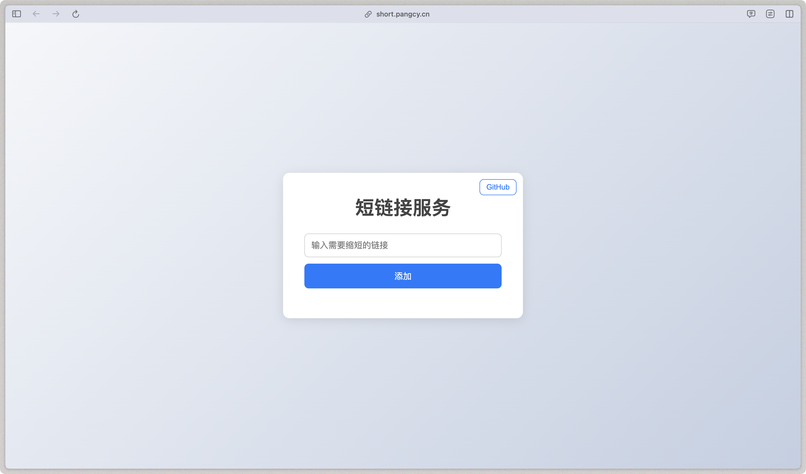

<!--
 * @Author: zi.yang
 * @Date: 2024-12-11 19:24:33
 * @LastEditors: zi.yang
 * @LastEditTime: 2025-06-10 00:11:43
 * @Description: 
 * @FilePath: /short-link/README.md
-->

# 短链接服务

一个基于 Vue、Fastify、Vercel 和 Supabase 构建的 URL 缩短服务。

## 概述

短链接服务允许用户缩短 URL，以便于分享和管理。它利用 Vue 作为前端框架，Fastify 作为后端，Vercel 进行部署，并使用 Supabase 作为数据库解决方案。

- 实现原理：[半个小时，我开发了个短链接服务](https://juejin.cn/post/7511983823259189287)
- 部署教程：[从零搭建一个免费稳定的私有短链接服务](https://juejin.cn/post/7511671401683992587)

## 在线访问

你可以在线访问该服务：[https://short.pangcy.cn](https://short.pangcy.cn)

## 功能

- **快速可靠**：使用 Fastify 构建，性能优越。
- **现代化 UI**：使用 Vue 构建的响应式用户界面。
- **可扩展性**：部署在 Vercel 上，确保可扩展性和可靠性。
- **安全性**：使用 Supabase 进行安全的数据存储。
- **用户友好界面**：简单直观的 UI，便于 URL 缩短。
- **管理员功能**：管理员可以查看和管理所有用户的链接。

## 管理员功能

### 设置管理员

管理员账号由系统开发者直接在 Supabase 中设置。

#### 第一步：添加 is_admin 字段

如果 `user_profiles` 表还没有 `is_admin` 字段，在 Supabase Dashboard 的 **SQL Editor** 中执行：

```sql
ALTER TABLE user_profiles ADD COLUMN IF NOT EXISTS is_admin BOOLEAN DEFAULT FALSE;
```

#### 第二步：设置管理员

**方式一：通过 Table Editor（推荐）**

1. 登录 [Supabase Dashboard](https://supabase.com/dashboard)
2. 进入你的项目
3. 点击左侧菜单 **Table Editor**
4. 选择 `user_profiles` 表
5. 找到要设置为管理员的用户
6. 勾选 `is_admin` 字段（设为 `true`）

**方式二：通过 SQL Editor**

```sql
-- 设置管理员（将 UUID 替换为实际用户 ID）
UPDATE user_profiles SET is_admin = true WHERE id = 'xxxxxxxx-xxxx-xxxx-xxxx-xxxxxxxxxxxx';

-- 取消管理员
UPDATE user_profiles SET is_admin = false WHERE id = 'xxxxxxxx-xxxx-xxxx-xxxx-xxxxxxxxxxxx';

-- 查看所有管理员
SELECT * FROM user_profiles WHERE is_admin = true;
```

### 管理员权限

设置为管理员后，用户登录系统将获得以下额外功能：

- **全局统计**：查看全站链接数、点击数、用户数等统计信息
- **所有链接管理**：查看和管理所有用户（包括匿名用户）创建的链接
- **链接详情**：查看任意链接的详细配置和访问日志
- **链接编辑**：编辑、启用/禁用、删除任意链接

管理员在 Dashboard 侧边栏会看到额外的「管理员」菜单区域，包含：
- 全局统计
- 所有链接

## 快速开始

### 前提条件

确保你已安装以下软件：

- Node.js
- Vercel CLI

### 安装

克隆仓库并安装依赖：

```bash
git clone https://github.com/Alessandro-Pang/short-link.git
cd short-link
pnpm install
```

### 本地开发

要在本地运行项目，请按照以下步骤操作：

1. 全局安装 Vercel CLI：

   ```bash
   npm install -g vercel@latest
   ```

2. 将你的项目与 Vercel 关联：

   ```bash
   vercel link
   ```

3. 拉取环境变量：

   ```bash
   vercel env pull .env.development.local
   ```

4. 启动开发服务器：

   ```bash
   npm run dev
   ```

## 使用方法

1. 在输入框中输入你希望缩短的 URL。
2. 点击"生成短链接"按钮生成短链接。
3. 复制生成的短链接以便分享。
4. 可以使用分享、生成二维码等功能方便地分享短链接。

## API 端点

### 公共端点

- `POST /api/addUrl` - 创建短链接
- `GET /u/:hash` - 短链接重定向
- `GET /api/expiration-options` - 获取过期时间选项

### 用户端点（需要认证）

- `GET /api/auth/user` - 获取当前用户信息
- `GET /api/dashboard/stats` - 获取用户统计数据
- `GET /api/dashboard/links` - 获取用户链接列表
- `GET /api/dashboard/links/:linkId` - 获取链接详情
- `PUT /api/dashboard/links/:linkId` - 更新链接
- `DELETE /api/dashboard/links/:linkId` - 删除链接

### 管理员端点（需要管理员权限）

- `GET /api/admin/stats` - 获取全局统计数据
- `GET /api/admin/links` - 获取所有链接列表
- `GET /api/admin/links/:linkId` - 获取任意链接详情
- `GET /api/admin/links/:linkId/logs` - 获取链接访问日志
- `PUT /api/admin/links/:linkId` - 更新任意链接
- `PATCH /api/admin/links/:linkId/toggle` - 切换链接状态
- `DELETE /api/admin/links/:linkId` - 删除任意链接
- `GET /api/admin/users` - 获取用户列表

## 界面预览



## 贡献

欢迎贡献！请 fork 仓库并提交 pull request 以进行任何改进或错误修复。

## 许可证

本项目采用 MIT 许可证。详情请参阅 [LICENSE](./LICENSE) 文件。
