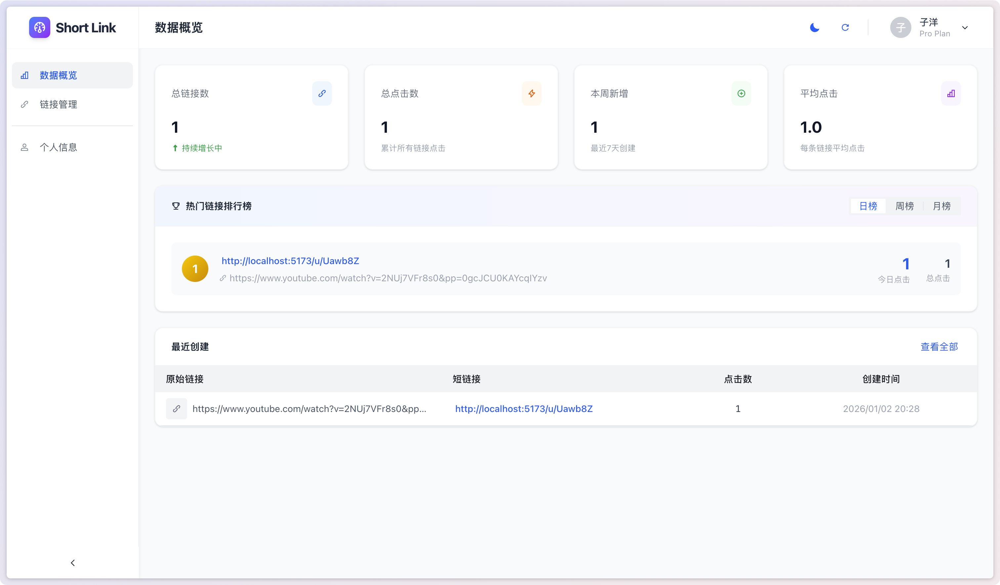
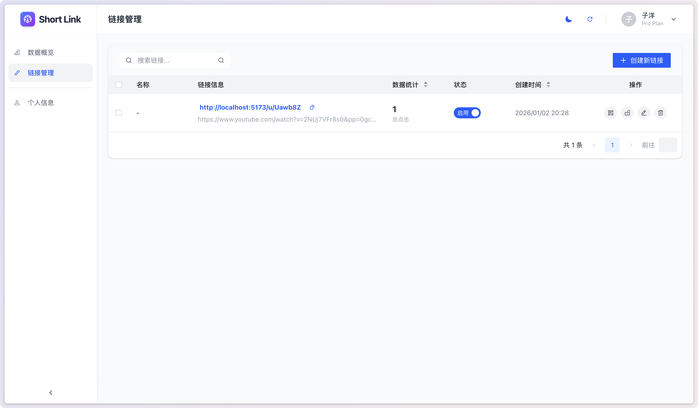
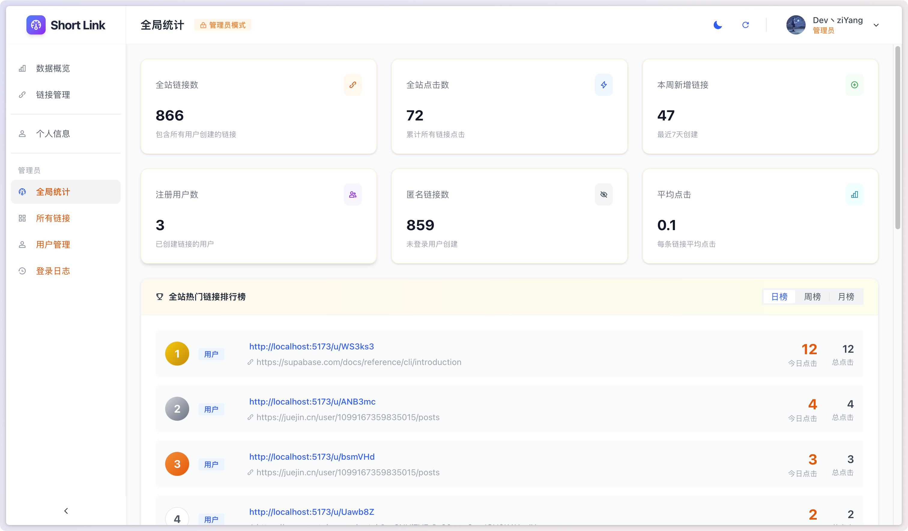
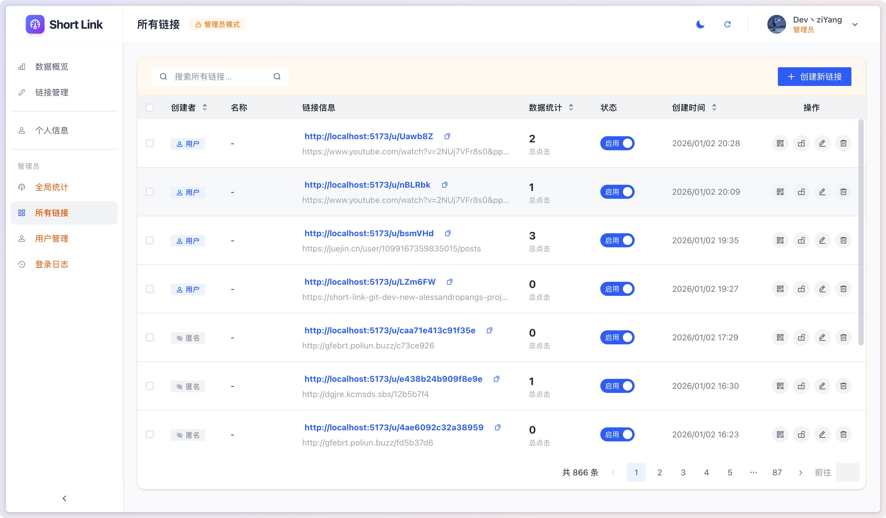
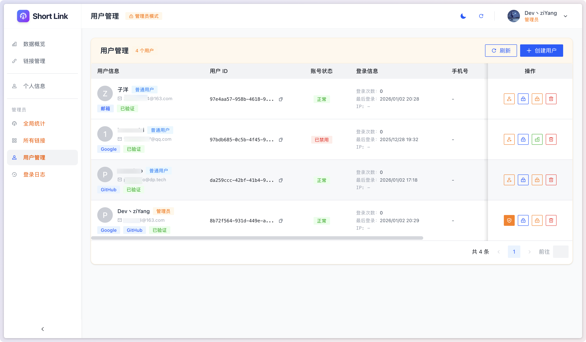
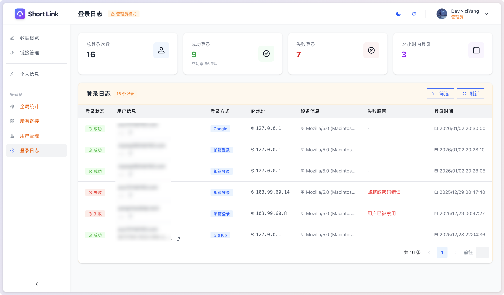

# 短链接服务 (Short Link V2.0)

一个功能完善的 URL 缩短服务，基于 Vue 3、Fastify、Vercel 和 Supabase 构建。

> [!DANGER] 注意：
>
> 当前 V2.0 版本由于更新内容较多，导致测试覆盖不全，以及部分功能没有完全实现

## 📖 概述

短链接服务允许用户快速缩短 URL，便于分享和管理。支持匿名创建和用户登录后的链接管理，提供丰富的链接配置选项和详细的访问统计。

> [!WARNING] 注意：
>
> 当前 V2.0 版本，与 V1.0 版本有较大的更新，下面的教程目前不能完全覆盖部署过程，v2.0 部署教程正在筹备中，请耐心等待。

### V1.0 部署教程

- 📝 实现原理：[半个小时，我开发了个短链接服务](https://juejin.cn/post/7511983823259189287)
- 🚀 部署教程：[从零搭建一个免费稳定的私有短链接服务](https://juejin.cn/post/7511671401683992587)

## 🌐 在线体验

访问 [https://short.pangcy.cn](https://short.pangcy.cn) 体验完整功能。

## ✨ 功能特性

### 核心功能
- **短链接生成**：快速将长链接转换为短链接
- **二维码生成**：自动生成短链接对应的二维码
- **链接有效期**：可设置链接过期时间
- **访问次数限制**：可设置最大访问次数
- **密码保护**：为链接设置访问密码

### 高级功能
- **访问统计**：详细的点击量、来源、设备等统计分析
- **访问限制**：
  - IP 白名单/黑名单
  - 设备类型限制（移动端/平板/桌面端）
  - 来源域名限制
  - 国家/地区限制
- **重定向配置**：支持 301/302/307/308 多种重定向类型
- **查询参数透传**：可选择是否将原链接参数传递给目标 URL
- **请求头转发**：支持自定义转发请求头

### 用户功能
- **用户认证**：支持邮箱注册登录、OAuth 第三方登录
- **链接管理**：查看、编辑、删除个人创建的链接
- **批量操作**：批量启用/禁用、删除链接
- **数据看板**：个人链接统计概览
- **热门排行**：查看点击量最高的链接

### 管理员功能
- **全局统计**：全站链接数、点击数、用户数等统计
- **用户管理**：查看用户列表、禁用/解禁用户、重置密码
- **链接审核**：管理所有用户（包括匿名用户）创建的链接
- **登录日志**：查看用户登录记录和异常检测
- **访问日志**：查看所有链接的详细访问记录

## 🛠 技术栈

### 前端
- **Vue 3** - 渐进式 JavaScript 框架
- **Pinia** - Vue 状态管理
- **Vue Router** - 路由管理
- **Arco Design Vue** - UI 组件库
- **TailwindCSS 4** - 原子化 CSS 框架
- **Vite 7** - 下一代前端构建工具

### 后端
- **Fastify 5** - 高性能 Node.js Web 框架
- **Supabase** - 开源 Firebase 替代品（PostgreSQL 数据库 + 认证）
- **nanoid** - 短链接 ID 生成

### 部署
- **Vercel** - 边缘部署平台（Serverless Functions）

## 📁 项目结构

```
short-link/
├── api/                    # Vercel Serverless 入口
│   └── index.ts
├── server/                 # 后端服务
│   ├── config/             # 配置管理
│   ├── controllers/        # 控制器层
│   ├── database/           # 数据库客户端
│   ├── middlewares/        # 中间件（认证、错误处理等）
│   ├── routes/             # 路由定义
│   ├── services/           # 业务逻辑层
│   ├── templates/          # 模板文件
│   ├── types/              # 类型定义
│   └── utils/              # 工具函数
├── src/                    # 前端源码
│   ├── assets/             # 静态资源
│   ├── components/         # 公共组件
│   ├── composables/        # 组合式函数
│   ├── router/             # 路由配置
│   ├── services/           # API 服务
│   ├── stores/             # Pinia 状态管理
│   ├── types/              # 类型定义
│   ├── utils/              # 工具函数
│   └── views/              # 页面组件
│       ├── account/        # 账号相关
│       ├── dashboard/      # 控制台
│       │   ├── admin/      # 管理员页面
│       │   ├── links/      # 链接管理
│       │   ├── profile/    # 个人信息
│       │   └── stats/      # 数据统计
│       ├── error/          # 错误页面
│       ├── home/           # 首页
│       ├── login/          # 登录
│       ├── password/       # 密码验证
│       └── register/       # 注册
├── config/                 # 项目配置
├── types/                  # 全局类型定义
├── supabase/               # Supabase 配置
└── public/                 # 公共静态资源
```

## 🚀 快速开始

### 前提条件

- Node.js 18+
- pnpm
- Vercel CLI
- Supabase 项目

### 安装

```bash
# 克隆仓库
git clone https://github.com/Alessandro-Pang/short-link.git

# 进入项目目录
cd short-link

# 安装依赖
pnpm install
```

### 配置环境变量

1. 全局安装 Vercel CLI：

   ```bash
   npm install -g vercel@latest
   ```

2. 关联 Vercel 项目：

   ```bash
   vercel link
   ```

3. 拉取环境变量：

   ```bash
   vercel env pull .env.development.local
   ```

### 本地开发

```bash
# 同时启动前端和后端开发服务器
pnpm dev

# 仅启动前端
pnpm dev:web

# 仅启动后端
pnpm dev:api
```

开发服务器启动后：
- 前端：http://localhost:5173
- 后端 API：http://localhost:3000
- API 文档：http://localhost:3000/api/docs（仅开发环境）

### 构建部署

```bash
# 构建前端
pnpm build

# 类型检查
pnpm type-check
```

## ⚙️ 环境变量

| 变量名 | 说明 | 必需 |
|--------|------|------|
| `SUPABASE_URL` | Supabase 项目 URL | ✅ |
| `SUPABASE_ANON_KEY` | Supabase 匿名 Key | ✅ |
| `SUPABASE_SERVICE_ROLE_KEY` | Supabase 服务端 Key | ✅ |
| `VITE_SUPABASE_URL` | 前端 Supabase URL | ✅ |
| `VITE_SUPABASE_ANON_KEY` | 前端 Supabase Key | ✅ |
| `ALLOWED_ORIGINS` | CORS 允许的域名（逗号分隔） | ❌ |
| `DEV_SERVER_PORT` | 开发服务器端口（默认 3000） | ❌ |

## 👑 管理员设置

管理员账号需要在 Supabase 数据库中手动设置。

**方式一：通过 Table Editor（推荐）**

1. 登录 [Supabase Dashboard](https://supabase.com/dashboard)
2. 进入你的项目
3. 点击左侧菜单 **Table Editor**
4. 选择 `user_profiles` 表
5. 找到要设置为管理员的用户
6. 勾选 `is_admin` 字段（设为 `true`）

**方式二：通过 SQL Editor**

```sql
-- 设置管理员（将 UUID 替换为实际用户 ID）
UPDATE user_profiles SET is_admin = true WHERE id = 'xxxxxxxx-xxxx-xxxx-xxxx-xxxxxxxxxxxx';

-- 取消管理员
UPDATE user_profiles SET is_admin = false WHERE id = 'xxxxxxxx-xxxx-xxxx-xxxx-xxxxxxxxxxxx';

-- 查看所有管理员
SELECT * FROM user_profiles WHERE is_admin = true;
```

## 🔒 安全特性

### 速率限制

| 接口类型 | 限制 |
|----------|------|
| 全局 | 100 次/分钟 |
| 创建短链接 | 10 次/分钟 |
| 登录相关 | 5 次/分钟 |
| 管理员接口 | 50 次/分钟 |
| 批量操作 | 20 次/分钟 |
| 短链接跳转 | 200 次/分钟 |

### SSRF 保护

- 禁止内网地址和私有 IP
- 禁止危险端口（22, 3306, 5432, 6379 等）
- 禁止云服务元数据端点
- 禁止危险协议（javascript, data, file 等）

## 📸 界面预览

### 用户端

<div style="display: flex; justify-content: center;">
    <div style="flex:1">
        
    </div>
    <div style="flex:1">
        
    </div>
    <div style="flex:1">
        
    </div>
    <div style="flex:1">
        
    </div>
</div>

### 管理员

<div style="display: flex; justify-content: center;">
    <div style="flex:1">
        
    </div>
    <div style="flex:1">
        
    </div>
    <div style="flex:1">
        
    </div>
    <div style="flex:1">
        
    </div>
</div>


## 🤝 贡献

欢迎贡献！请 Fork 仓库并提交 Pull Request。

1. Fork 本仓库
2. 创建特性分支 (`git checkout -b feature/AmazingFeature`)
3. 提交更改 (`git commit -m 'Add some AmazingFeature'`)
4. 推送到分支 (`git push origin feature/AmazingFeature`)
5. 提交 Pull Request

## 📄 许可证

本项目采用 MIT 许可证 - 详情请参阅 [LICENSE](./LICENSE) 文件。

## 📧 联系作者

- GitHub: [@Alessandro-Pang](https://github.com/Alessandro-Pang)
- 项目主页: [https://github.com/Alessandro-Pang/short-link](https://github.com/Alessandro-Pang/short-link)
- 问题反馈: [https://github.com/Alessandro-Pang/short-link/issues](https://github.com/Alessandro-Pang/short-link/issues)
